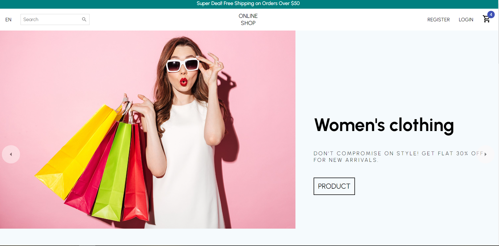

# Relq_ecommerce_project

## ⭐ Description 
                     
*This is an online shop for Lady clothing and toys. Project was built using* 
<ul>
  <li>react.js</li>
  <li>styled-components</li>
  <li>and UI materials</li>
</ul>

## Features

*Select the product*
<ul>
  <li>adding items to a cart</li>
  <li>sending an email</li>
</ul>

### Installing
<ul>
   <li>git clone https://github.com/lilitavanesyan1997/Relq_ecommerce_project</li>
   <li>cd Relq_ecommerce_project</li>
   <li>`npm install`</li>
</ul>

## 🛠  To run

*npm start*
*Open http://localhost:3000 to view it in the browser*

